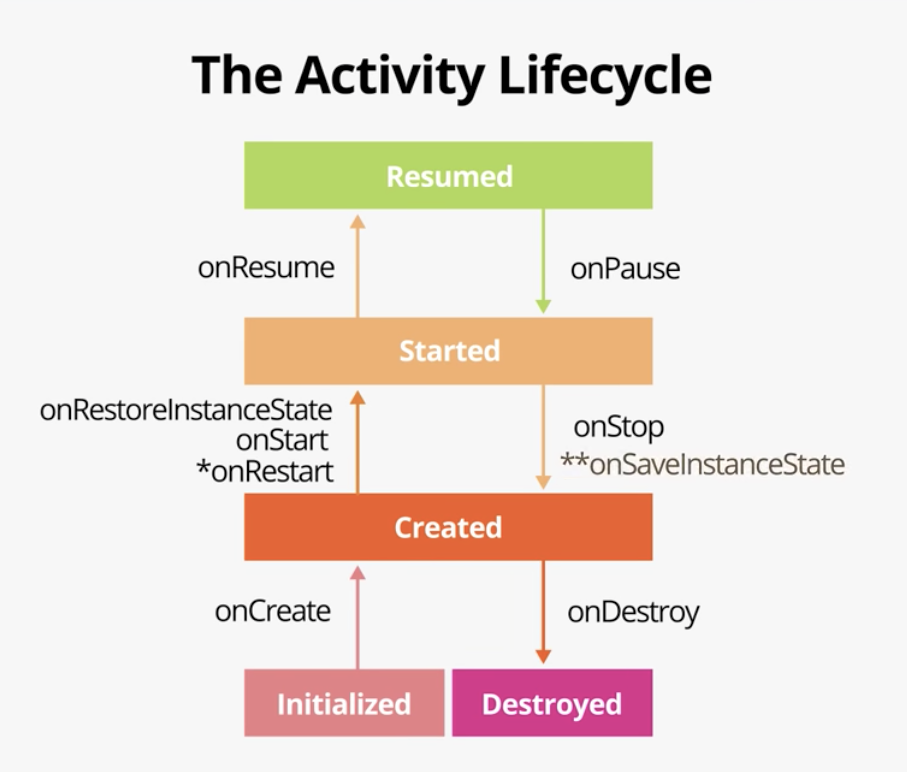

# android-codelabs

This repo contains the codelabs of "Android Basics in Kotlin" course from developer.android.com.  
_Source: https://developer.android.com/courses/android-basics-kotlin/course_

# Table of Contents

* [Apps meta](#apps-meta)
* [Useful links](#useful-links)
* [Unit 1 - Kotlin Basics](#kotlin-basics)
  * [Basic](#basic)
  * [Testing](#testing)
  * [Layouts](#layouts)
  * [Pixel densities](#pixel-densities)
  * [Activities](#activities)
  * [Logging](#logging)
* [Unit 2 - Layouts](#unit2-layouts)
  * [Abstraction](#abstraction)
  * [with operator](#with-operator)
  * [lateinit](#lateinit)
  * [View binding](#view-binding)
  * [Design](#design)
  * [Gradle](#gradle)
  * [Instrumentation Tests](#instrumentation-tests)
  * [Lists and MutableLists](#lists-and-mutablelists)
  * [Recycler View](#recycler-view)
  * [Annotations](#annotations)
* [Unit 3 - Navigation](#unit3-navigation)
  * [Collections](#collections)
  * [Intents](#intents)
  * [Stages of the activity lifecycle](#stages-of-the-activity-lifecycle)
  * [Fragments](#fragments)
  * [Navigation](#navigation)
  * [App architecture](#app-architecture)
  * [Kotlin property delegate](#kotlin-propety-delegate)
  * [Backing properties](#backing-properties)
  * [LiveData](#livedata)
  * [Data binding](#data-binding)

## Apps meta

* **Affirmations** - RecyclerView basic example, instrumentation tests.
* **Dogglers** - RecyclerView, different screen orientations.
* **TipTime** - themes and styles, adaptive app icons, instrumentation tests.
* **DessertClicker** - activity life cycle.
* **Cupcake** - navigation, multiple fragments, data binding
* **Lunch Tray** - navigation, Android architecture.
* **Words** - intents, fragments, RecyclerView, instrumentation tests for the nav controller.
* **Unscramble** - LiveData.

## Useful links

* **Kotlin style guide** can be found [here](https://developer.android.com/kotlin/style-guide).
* Documentation for **app developers** [here](https://developer.android.com/docs).
* `NumberFormat` [documentation](https://developer.android.com/reference/java/text/NumberFormat).
* **Material Design**, [link here](https://material.io/design/introduction).
* **Text fields** using material design [here](https://material.io/develop/android/components/text-fields).
* **Dialogs** with material design [link here](https://material.io/develop/android/components/dialogs).
* **Material Theming**, [link here](https://material.io/design/material-theming/overview.html#material-theming).
* **Material icons** can be found [here](https://fonts.google.com/icons?selected=Material+Icons).
* **Color Tool** - pick colors for your app, can be found [here](https://material.io/resources/color/#!/?view.left=0&view.right=0).
* List of **density qualifiers** [here](https://developer.android.com/training/multiscreen/screendensities#TaskProvideAltBmp).
* **Activity lifecycle** is described [here](https://developer.android.com/codelabs/basic-android-kotlin-training-activity-lifecycle?continue=https%3A%2F%2Fdeveloper.android.com%2Fcourses%2Fpathways%2Fandroid-basics-kotlin-unit-3-pathway-1%23codelab-https%3A%2F%2Fdeveloper.android.com%2Fcodelabs%2Fbasic-android-kotlin-training-activity-lifecycle#5).
* **Fragments** codelab, [link here](https://developer.android.com/codelabs/basic-android-kotlin-training-fragments-navigation-component?continue=https%3A%2F%2Fdeveloper.android.com%2Fcourses%2Fpathways%2Fandroid-basics-kotlin-unit-3-pathway-2%23codelab-https%3A%2F%2Fdeveloper.android.com%2Fcodelabs%2Fbasic-android-kotlin-training-fragments-navigation-component#2).
* **Fragments lifecycle** [description here](https://www.geeksforgeeks.org/fragment-lifecycle-in-android/).
* Android **app architecture** documentation [link here](https://developer.android.com/topic/architecture).
* `lateinit` vs `lazy` article [here](https://agrawalsuneet.github.io/blogs/lateinit-vs-lazy-property-in-kotlin/#:~:text=lateinit%20can%20only%20be%20used,can%20only%20be%20initialised%20once.).

## Unit 1 - Kotlin Basics

### Basic

To print in console, we use:

```
println("Hello world")
```

The **package name** is the name used by the Android system to **uniquely identify** your app. Usually, this defaults to the name of your organization followed by the name of the app. E.g.: _com.companyname.yourapp_.


* `when` statement is used to replace `if` - `else if` statements. Is similar with `switch` in other languages. Example [here](https://play.kotlinlang.org/byExample/02_control_flow/01_When).

```
when (rollResult) {
    luckyNumber -> println("You won!")
    1 -> println("So sorry! You rolled a 1. Try again!")
    2 -> println("Sadly, you rolled a 2. Try again!")
    3 -> println("Unfortunately, you rolled a 3. Try again!")
    5 -> println("Don't cry! You rolled a 5. Try again!")
    6 -> println("Apologies! You rolled a 6. Try again!")
    else -> { // do something }
}
```
* Scope functions - https://kotlinlang.org/docs/scope-functions.html.

**What is a program?**   
A series of instructions that a computer system executes to accomplish some action

### Testing

Testing theory [notes can be found here](https://developer.android.com/codelabs/android-basics-kotlin-testing-basics?continue=https%3A%2F%2Fdeveloper.android.com%2Fcourses%2Fpathways%2Fandroid-basics-kotlin-two%23codelab-https%3A%2F%2Fdeveloper.android.com%2Fcodelabs%2Fandroid-basics-kotlin-testing-basics#1) and [here](https://developer.android.com/codelabs/android-basics-kotlin-write-unit-tests?continue=https%3A%2F%2Fdeveloper.android.com%2Fcourses%2Fpathways%2Fandroid-basics-kotlin-four%23codelab-https%3A%2F%2Fdeveloper.android.com%2Fcodelabs%2Fandroid-basics-kotlin-write-unit-tests#1).

**Local tests** in Android are executed on the JVM, which means they run in a development environment without needing a device or emulator.  
When running an **instrumentation test** on Android, the test code is actually built into its own APK.

To add tests for an app, we add the following to `app/build.gradle`:
```
testImplementation 'junit:junit:4.12'
````
You can think of **annotation** as metadata tags for a piece of code that can change the way the code is compiled.

Key terms to know when referring to testing code:
* **Test Suite** - the target that includes all your _test cases_.
* **Test Case** - a class consisting of individual tests for related functionality.
* **Test** - a function that tests one specific thing.

Tests should not suppose to contain logic, no `if`-s or `when`-s. They should not manipulate values or conduct real computations.

### Layouts

A **ViewGroup** is a container that **View** objects sit in, and is responsible for arranging the **Views** inside it. E.g.: **ConstraintLayout**.  
A **margin** says how far a View is from an edge of the container it's in.  
In Android, a graphic that can be drawn to the screen is generally referred to as a **Drawable**.

**Classes** are like a blueprint of an object. They can have properties and behaviors, implemented as variables and functions.
**An instance of a class** represents an object, often a physical object, such as a dice. You can call the actions on the object and change its attributes.

### Pixel densities

* **sp** - scalable pixels, a unit of measure of the font size.
* **dp** - density-independent-pixels.
By default, sp is the same size as dp, but it resizes based on the user's preferred text size.
```
px = dp * (dpi / 160)
```

### Activities

An **Activity** provides the window in which your app draws its UI. Typically, an **Activity** takes up the whole screen of your running app.

When it assigns an object to a variable, Kotlin doesn't copy the entire object each time, it saves a reference to the object.

Adding drawables to the project is demo-ed [here](https://developer.android.com/codelabs/basic-android-kotlin-training-dice-roller-images?continue=https%3A%2F%2Fdeveloper.android.com%2Fcourses%2Fpathways%2Fandroid-basics-kotlin-four%23codelab-https%3A%2F%2Fdeveloper.android.com%2Fcodelabs%2Fbasic-android-kotlin-training-dice-roller-images#2).

To access resources, we use:
```
getResources().getString(...)
```

### Logging

| Log Level | Use Case |
| ----------- | ----------- |
| ERROR | ERROR logs report that something went seriously wrong, such as the reason why an app crashed. |
| WARN | WARN logs are less severe than an error but still report something that should be fixed to avoid a more serious error. An example might be if you call a function that's _deprecated_, meaning that its use is discouraged in favor of a newer alternative. |
| INFO | INFO logs provide useful information, such as an operation being successfully completed. |
| DEBUG | DEBUG logs contain information that may be useful when investigating an issue. These logs are not present in release builds such as one you'd publish on the Google Play Store. |
| VERBOSE | As the name implies, verbose is the least specific log level. What's considered a debug log, versus a verbose log, is a bit subjective, but generally, a verbose log is something that can be removed after a feature is implemented, whereas a debug log may still be useful for debugging. These logs are also not included in release builds. |

The **stack trace** provides information about an exception, such as the exact function that caused it and the line number where the exception occurred.

## Unit 2 - Layouts

### Abstraction

Example of abstraction and inheritance:
```
abstract class Dwelling(private var residents: Int) {
    abstract val buildingMaterial: String
    abstract val capacity: Int

    fun hasRoom(): Boolean {
       return residents < capacity
   }
}

class SquareCabin(residents: Int) : Dwelling(residents) {
    override val buildingMaterial = "Wood"
    override val capacity = 6
}
```

### with operator

Kotlin `with` operator is applied to an instance of a class and it provides access to its properties.

### lateinit

The `lateinit` keyword is something new. It's a promise that your code will initialize the variable before using it. If you don't, your app will crash.

### View binding

To enable the view binding, open the app's `build.gradle` and add the following lines:
```
buildFeatures {
    viewBinding = true
}
```
This will enable `findViewById` method.

```
class MainActivity : AppCompatActivity() {

    lateinit var binding: ActivityMainBinding

    override fun onCreate(savedInstanceState: Bundle?) {
        super.onCreate(savedInstanceState)
        binding = ActivityMainBinding.inflate(layoutInflater)
        setContentView(binding.root)
    }
}

// Old way with findViewById()
val myButton: Button = findViewById(R.id.my_button)
myButton.text = "A button"

// Better way with view binding
val myButton: Button = binding.myButton
myButton.text = "A button"

// Best way with view binding and no extra variable
binding.myButton.text = "A button"
```
More to read [https://developer.android.com/topic/libraries/view-binding](here).

### Design

> Material Design is inspired by the physical world and its textures, including how objects reflect light and cast shadows. It provides guidelines on how to build your app UI in a readable, attractive, and consistent manner. Material Theming allows you to adapt Material Design for your app, with guidance on customizing colors, typography, and shapes. Material Design comes with a built-in, baseline theme that can be used as-is. You can then customize it as little, or as much, as you like to make Material work for your app.

_Source from "Get user input in an app Part 2" codelab, [here](https://developer.android.com/codelabs/basic-android-kotlin-training-change-app-theme?continue=https%3A%2F%2Fdeveloper.android.com%2Fcourses%2Fpathways%2Fandroid-basics-kotlin-unit-2-pathway-2%23codelab-https%3A%2F%2Fdeveloper.android.com%2Fcodelabs%2Fbasic-android-kotlin-training-change-app-theme#1)._

* **Colors** are represented in HEX and it can also contain the alpha value at the beginning (**#00-#FF**), which represents the transparency (**#00 = 0% = fully transparent, #FF = 100% opaque**).
* A **style** can specify attributes for a `View`, such as font color, font size, background color, and much more.
* A **theme** is a collection of styles that's applied to an entire app, activity, or view hierarchy - not just an individual `View`.

Material design supports **12 categories of color** that can be applied to components, text, icons, and surfaces.

| # | Name | Theme Attribute |
| --- | ----- | ----------- |
| 1 | Primary | `colorPrimary` |
| 2 | Primary Variant | `colorPrimaryVariant` |
| 3 | Secondary | `colorSecondary` |
| 4 | Secondary Variant | `colorSecondaryVariant` |
| 5 | Background | `colorBackground` |
| 6 | Surface | `colorSurface` |
| 7 | Error | `colorError` |
| 8 | On Primary | `colorOnPrimary` |
| 9 | On Secondary | `colorOnSeconday` |
| 10 | On Background | `colorOnBackground` |
| 11 | On Surface | `colorOnSurface` |
| 12 | On Error | `colorOnError` |

* To add material design components, we add the following dependency:
```
dependencies {
    ...
    implementation 'com.google.android.material:material:<version>'
}
```
* Dark theme codelab [here](https://developer.android.com/codelabs/basic-android-kotlin-training-change-app-theme?continue=https%3A%2F%2Fdeveloper.android.com%2Fcourses%2Fpathways%2Fandroid-basics-kotlin-unit-2-pathway-2%23codelab-https%3A%2F%2Fdeveloper.android.com%2Fcodelabs%2Fbasic-android-kotlin-training-change-app-theme#4).
* App icon codelab [here](https://developer.android.com/codelabs/basic-android-kotlin-training-change-app-icon?continue=https%3A%2F%2Fdeveloper.android.com%2Fcourses%2Fpathways%2Fandroid-basics-kotlin-unit-2-pathway-2%23codelab-https%3A%2F%2Fdeveloper.android.com%2Fcodelabs%2Fbasic-android-kotlin-training-change-app-icon#2).
* >When styling a component, you should generally extend from a parent style of the widget type you are using. This is important for two reasons. First, it makes sure all important default values are set on your component, and secondly, your style will continue to inherit any future changes to that parent style. <br />
_Source: Android Codelab "Create a more polished user experience", [link here](https://developer.android.com/codelabs/basic-android-kotlin-training-polished-user-experience?continue=https%3A%2F%2Fdeveloper.android.com%2Fcourses%2Fpathways%2Fandroid-basics-kotlin-unit-2-pathway-2%23codelab-https%3A%2F%2Fdeveloper.android.com%2Fcodelabs%2Fbasic-android-kotlin-training-polished-user-experience#4)._

* **Adaptive icons** are made up of two layers: a foreground and a background layer.
* Place app icon files in the **mipmap** resource directories.
* Tutorial on how to add drawable assets, codelab "Get user input in an app: Part 2" [link here](https://developer.android.com/codelabs/basic-android-kotlin-training-polished-user-experience?continue=https%3A%2F%2Fdeveloper.android.com%2Fcourses%2Fpathways%2Fandroid-basics-kotlin-unit-2-pathway-2%23codelab-https%3A%2F%2Fdeveloper.android.com%2Fcodelabs%2Fbasic-android-kotlin-training-polished-user-experience#3).

### Gradle

* is an automated build system used by Android Studio to build apps.
* handles installing your app on a device.
* you can configure Android-specific options for your project in your app's `build.gradle`.

### Instrumentation Tests

* > `ActivityScenarioRule` comes from the AndroidX Test library. It tells the device to launch an activity specified by the developer. You'll need to annotate it with @get:Rule, which specifies that the subsequent rule, in this case launching an activity, should execute before every test in the class. Test rules are an essential tool for testing, and eventually you will learn how to write your own.<br />
_Source: [Codelab "Write Instrumentation Tests"](https://developer.android.com/codelabs/android-basics-kotlin-write-instrumentation-tests?continue=https%3A%2F%2Fdeveloper.android.com%2Fcourses%2Fpathways%2Fandroid-basics-kotlin-unit-2-pathway-2%23codelab-https%3A%2F%2Fdeveloper.android.com%2Fcodelabs%2Fandroid-basics-kotlin-write-instrumentation-tests#3)_
* Espresso is a library to be used for interacting with UI components through code.

### Lists and MutableLists

* `List` - are read-only and can't be modified after creation.
* `MutableList` - can be modified after you create them

### Recycler View

* Components involved in creating and using a `RecyclerView`
  * **item** - the data to be displayed.
  * **Adapter** - takes data and prepares it for display.
  * **ViewHolders** - the rows / views to be used and displayed data.
  * **RecyclerView** - views on screen.
* It supports displaying items in a grid or a list view.
* To display the items on screen, we use a `layoutManager`. E.g. `LinearLayoutManager`.
* In the adapter, the `onCreateViewHolder()` method is used to create new view holders for the `RecyclerView` when there aren't any available to be reused.
* The method `onBindViewHolder()` is called by the layout manager to replace the contents of a list item view.

Example of adapter:
```
class ItemAdapter(
    private val context: Context,
    private val dataset: List<Affirmation>
) : RecyclerView.Adapter<ItemAdapter.ItemViewHolder>() {

    class ItemViewHolder(view: View) : RecyclerView.ViewHolder(view) {
        val imageView: ImageView = view.findViewById(R.id.item_image)
        val textView: TextView = view.findViewById(R.id.item_title)
    }

    override fun onCreateViewHolder(parent: ViewGroup, viewType: Int): ItemViewHolder {
        val adapterLayout = LayoutInflater.from(parent.context)
            .inflate(R.layout.list_item, parent, false)

        return ItemViewHolder(adapterLayout)
    }

    override fun onBindViewHolder(holder: ItemViewHolder, position: Int) {
        val item = dataset[position]
        holder.textView.text = context.resources.getString(item.stringResourceId)
        holder.imageView.setImageResource(item.imageResourceId)
    }

    override fun getItemCount(): Int {
        return dataset.size
    }
}
```

### Annotations

* `@StringRes` and `@DrawableRes` - to get the string or drawable resources.

```
package com.example.affirmations.model

import androidx.annotation.DrawableRes
import androidx.annotation.StringRes

data class Affirmation(
   @StringRes val stringResourceId: Int,
   @DrawableRes val imageResourceId: Int
)
```
## Unit 3 - Navigation

### Collections

* contains related items and can be ordered or unordered, unique or not unique.
* Example of map data type:
```
val peopleAges = mutableMapOf<String, Int>(
    "Fred" to 30,
    "Ann" to 23
)
```
* `forEach` iterates over the elements.
```
peopleAges.forEach { print("${it.key} is ${it.value}, ") }
```
* `map` applies a transformation to each element of the list.
```
peopleAges.map { "${it.key} is ${it.value}" }
```
* `filter` is used to filter the elements based on a criteria.
```
val filteredNames = peopleAges.filter { it.key.length < 4 }
println(filteredNames) // {Ann=23, Joe=51}
```
* **Lambda function** - functions without a name.
* **Function type** example:
```
(Int) -> Int
```
* **High-order functions** - passing a function to another function, or returning a function from another function.

### Intents

* An intent is an object representing some action to be performed.
* Used to launch an activity.
* There are two types: **implicit** and **explicit**.

### Stages of the activity lifecycle

* Activity lifecycle represented below:



_Source: https://developer.android.com/codelabs/basic-android-kotlin-training-activity-lifecycle/img/f6b25a71cec4e401.png_

* **onCreate()**
  * to create the app.
  * called **only once**, just after the activity is initialized.
* **onStart()**
  * to start it and make it visible on the screen.
  * called just after `onCreate()`.
  * in this state, the activity is visible on the screen.
  * `onStart()` is paired with `onStop()` and if the user starts your app and switches to another app or returns to the home screen, it will go in this state.
* **onResume()**
  * to give the activity focus and make it ready for the user to interact with it.
* **onPause()**
  * the app no longer has focus.
* **onStop()**
  * the app is no longer visible on screen.
* **onDestroy()**
  * the activity has been shut down and can be garbage-collected.
  * called when you explicitly make a call to `finish()`.
  * called **only once**.
* Both **onResume()** and **onPause()** have to do with focus. The **onResume()** method is called when the activity has focus, and **onPause()** is called when the activity loses focus.
* It is possible for an activity to be **partially visible** on the screen, but not have user focus. In this case, **onStop()** is not called.

> Your activity does not close down entirely every time the user navigates away from that activity:<br />
> * When your activity is no longer visible on screen, this is known as putting the activity into the background. (The opposite of this is when the activity is in the foreground, or on screen.)<br />
> * When the user returns to your app, that same activity is restarted and becomes visible again. This part of the lifecycle is called the app's visible lifecycle. <br />

_**Source**: codelab "Stages of the activity lifecycle". [Link here](https://developer.android.com/codelabs/basic-android-kotlin-training-activity-lifecycle?continue=https%3A%2F%2Fdeveloper.android.com%2Fcourses%2Fpathways%2Fandroid-basics-kotlin-unit-3-pathway-1%23codelab-https%3A%2F%2Fdeveloper.android.com%2Fcodelabs%2Fbasic-android-kotlin-training-activity-lifecycle#3)._

* A **configuration change** happens when the state of the device changes so much that the system needs to shut down and rebuild the activity. E.g. user changes the device language, rotation from portrait to landscape.
* The `onSaveInstanceState()` is used to save bundle data when the activity exits foreground.
* Use `onCreate()` or `onRestoreInstanceState(Bundle)` to restore bundle data.
* Most of the time, you restore the activity state in `onCreate()`. But because `onRestoreInstanceState(Bundle)` is called after `onStart()`, you can restore some state after `onCreate()`.

### Fragments

* Fragments are a reusable piece of the apps interface. They have their own lifecycle.
* They are always contained within the view hierarchy of an activity when its shown onscreen.

The fragment lifecycle has **five states**:
1. **INITIALIZED** - a new fragment has been instantiated.
2. **CREATED** - the view associated is created.
3. **STARTED** - fragment is visible on screen but hasn't focus.
4. **RESUMED** - fragment is visible and has focus.
5. **DESTROYED** - the fragment has been de-instantiated.

Like activities, there are methods that you can override for fragments:

* `onCreate()`: The fragment has been instantiated and is in the **CREATED** state. However, its corresponding view has not been created yet.
* `onCreateView()`: This method is where you inflate the layout. The fragment has entered the **CREATED** state.
* `onViewCreated()`: This is called after the view is created. In this method, you would typically bind specific views to properties by calling `findViewById()`.
* `onStart()`: The fragment has entered the **STARTED** state.
* `onResume()`: The fragment has entered the **RESUMED** state and now has focus (can respond to user input).
* `onPause()`: The fragment has re-entered the **STARTED** state. The UI is visible to the user
* `onStop()`: The fragment has re-entered the **CREATED** state. The object is instantiated but is no longer presented on screen.
* `onDestroyView()`: Called right before the fragment enters the **DESTROYED** state. The view has already been removed from memory, but the fragment object still exists.
* `onDestroy()`: The fragment enters the **DESTROYED** state.

_Source: [Android codelab Fragments and Navigation component](https://developer.android.com/codelabs/basic-android-kotlin-training-fragments-navigation-component?continue=https%3A%2F%2Fdeveloper.android.com%2Fcourses%2Fpathways%2Fandroid-basics-kotlin-unit-3-pathway-2%23codelab-https%3A%2F%2Fdeveloper.android.com%2Fcodelabs%2Fbasic-android-kotlin-training-fragments-navigation-component#2)._

Fragments lifecycle diagram is presented below:


_Source: https://developer.android.com/codelabs/basic-android-kotlin-training-fragments-navigation-component/img/8dc30a4c12ab71b.png_

---
**NOTE**
* **Key difference between fragments and activities lifecycle is the `onCreate()` method. With activities, you use this method to inflate the layout and bind views. However, in fragments the method is called before the view is created, so you can't inflate the layout here. Instead, you do this in `onCreateView()`. Then, after the view has been created, the `onViewCreated()` method is called, where you can bind properties to specific views.**
---

* Fragments and activity lifecycle diagram:


_Source: https://basaransuleyman.medium.com/android-activity-lifecycle-and-fragment-lifecycle-states-and-method-descriptions-136efc3c2ff3_

### Navigation

* **Navigation Graph** - visual representation of your navigation in an XML.
* **NavHost** - used to display destinations from a navigation graph within an activity.
* **NavController** - lets you control the navigation between destinations displayed in the `NavHost`.
* Dependencies to add in `build.gradle`:

```
classpath "androidx.navigation:navigation-safe-args-gradle-plugin:$nav_version"

implementation "androidx.navigation:navigation-fragment-ktx:$nav_version"
implementation "androidx.navigation:navigation-ui-ktx:$nav_version

plugins {
    id 'com.android.application'
    id 'kotlin-android'
    id 'kotlin-kapt'
    id 'androidx.navigation.safeargs.kotlin'
}
```
* A `FragmentContainerView` is used to embed fragments in other activities and can manage navigation between fragments:

```
<androidx.fragment.app.FragmentContainerView
    android:id="@+id/nav_host_fragment"
    android:name="androidx.navigation.fragment.NavHostFragment"
    android:layout_width="match_parent"
    android:layout_height="match_parent"
    app:defaultNavHost="true"
    app:navGraph="@navigation/nav_graph"/>
```

* Adding support for the back button (up button):
```
override fun onSupportNavigateUp(): Boolean {
    return navController.navigateUp() || super.onSupportNavigateUp()
}
```


### App architecture

* The most common architectural principles are:
  * separation of concerns - the app should be divided into classes, each with separate responsibilities.
  * driving UI from a model.
* **UI Controller** - are represented by activities or fragments. They are responsible for drawing views and data to the screen and responding to the user events.
* **ViewModel** - is a model of the app data that is displayed in the views. These are components that are responsible for handling the data for an app. They hold and process all the data required by the UI. They should not access view binding object or hold a reference to the activity or the fragment.
* The app will lose the state of the `viewModel` reference when it goes through a configuration change.
* The lifecycle of a `ViewModel` is presented below:


_Source: https://developer.android.com/codelabs/basic-android-kotlin-training-viewmodel/img/18e67dc79f89d8a.png_

### Kotlin property delegate

* Syntax is presented below:

```
// Syntax for property delegation
var <property-name> : <property-type> by <delegate-class>()

private val viewModel: GameViewModel by viewModels()
```

* Property delegation in Kotlin helps you to handoff the getter-setter responsibility to a different class.

### Backing properties

* Allows you to return something from a getter other than the exact object.

```
// Declare private mutable variable that can only be modified
// within the class it is declared.
private var _count = 0

// Declare another public immutable field and override its getter method.
// Return the private property's value in the getter method.
// When count is accessed, the get() function is called and
// the value of _count is returned.
val count: Int
   get() = _count
```

### LiveData

* `LiveData` is an observable data holder class that is lifecycle-aware.
* is a wrapper that can be used with any type of data.

### Data binding

* binds the UI components in your layouts to data sources in your app using a declarative format.

```
// Transforms this:
binding.textViewUnscrambledWord.text = viewModel.currentScrambledWord

// into this:
android:text="@{gameViewModel.currentScrambledWord}"
```
